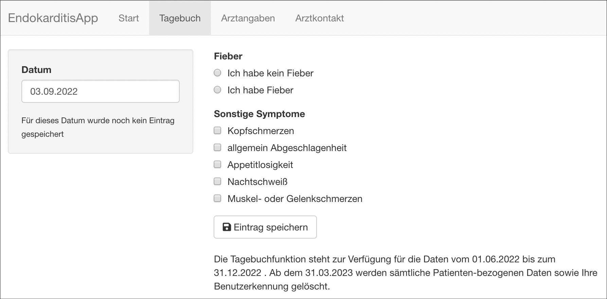

# EndokarditisApp

Die Endokarditis App stellt eine Möglichkeit zur Verfügung, die Körpertemperatur, sowie zusätzlich allgemeine Krankheitssymptome im Verlauf zu dokumentieren. Zusätzlich werden personenbezogene Daten und Informationen zur Krankengeschichte erfasst. Die Software richtet sich speziell an Patienten, die sich in der ambulanten Nachbetreuung nach einer stationären Behandlung einer Endokarditis befinden, sowie deren weiterbehandelnden Ärzte.  Mit der Software soll diese Phase der Behandlung sicherer und transparenter gestaltet werden und kritische Ereignisse frühzeitig erkannt werden. 
Die erfassten Messwerte und Informationen sollen eine Beurteilung des Verlaufs durch den weiterbehandelnden Arzt ermöglichen und bei auffällig abweichenden Messwerten eine Handlungsempfehlung an den Patienten ausgeben. 
Es existieren weder Varianten noch Zubehör oder Erweiterungen. Das Produkt wird zum Download angeboten via Website oder App Store. Eine Verpackung ist nicht vorgesehen. 
Die Software wird ausschließlich in deutscher Sprache veröffentlicht, eine Schulung ist nicht vorgesehen, es gibt eine integrierte Bedienungsanleitung und Hilfestellung.

Autoren:
Lucie Kretzler, Lukas Herold, Timm Kandaouroff

Bezüglich Installation und Nutzung der App verweisen wir auf die beiliegende [Bedienungsanleitung](Bedienungsanleitung%20EndokarditisApp.pdf).

Als Entwicklungsumgebung wurde R-Studio 2022.07.1 Build 554 genutzt, als Programmiersprache R in der Version 4.2.1, unter Verwendung folgender Packages:

“Shiny from RStudio” (shiny)  in der Version 1.7.2, als Web Applikation Framework
https://cran.r-project.org/web/packages/shiny/index.html

“A Wrapper of the JavaScript Library ‘DataTables’” (DT) ab Version 0.24
https://cran.r-project.org/web/packages/DT/index.html

“Tools for Splitting, Applying and Combining Data” (plyr) ab Version 1.8.7
https://cran.r-project.org/web/packages/plyr/index.html

“Authentication Management for ‘shiny’ Applications” (shinymanager) ab Version 1.0.400
https://cran.r-project.org/web/packages/shinymanager/index.html

“Database Interface and ‘MySQL’ Driver for R” (RMySQL) ab Version 0.10.23
https://cran.r-project.org/web/packages/RMySQL/index.html

“‘Blowfish Password Hashing Algorith” (brypt)  ab Version 1.1
https://cran.r-project.org/web/packages/bcrypt/index.html

Als Entwicklungsumgebung zur Modellierung und Erstellung der Datenbank wurde MySQL Workbench in der Version 8.0.30. genutzt. 
